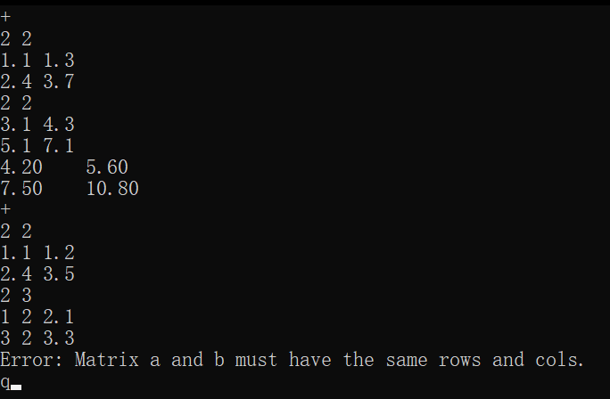
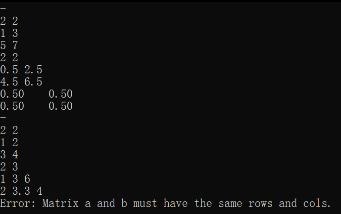
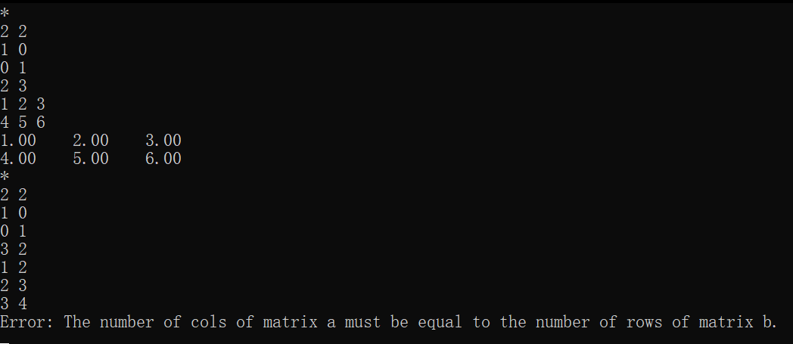
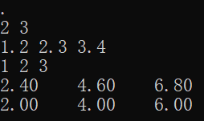
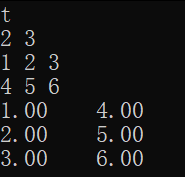
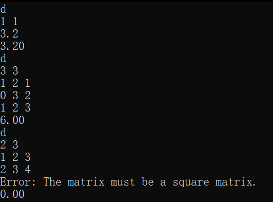
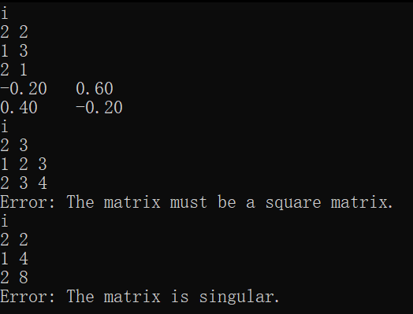
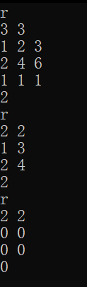
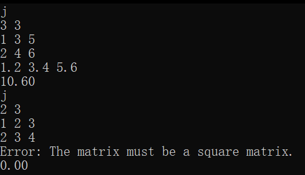

# README

## 一、思路

### 1.加减乘数乘转置

利用for循环遍历，直接按照矩阵运算规律计算每一格。

### 2.行列式

按第一行展开，遍历每个元素，构造对应的(n-1)×(n-1)余子式（排除首行和当前列），用flag的正负交替累加元素值×余子式行列式，最终返回总和。

### 3.逆

计算原矩阵的伴随矩阵（余子式和行列式里面提到的计算方法一致），除以原矩阵的行列式即得逆矩阵。

### 4.秩

用高斯消元法：逐列选主元并交换行，把下方元素消去形成上三角结构。如果主元是0就直接跳过，否则消元。最后统计非零行数量即为秩。

### 5.迹

直接求对角线元素之和

## 二、运行截图

### 1.加法

### 2.减法

### 3.乘法

### 4.数乘

### 5.转置

### 6.行列式

### 7.逆

### 8.秩

### 9.迹

